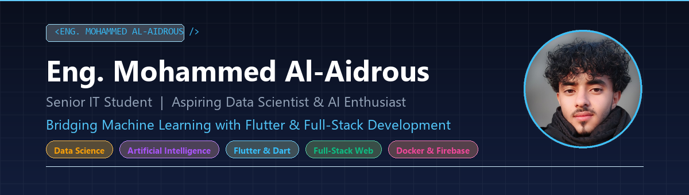

  

    

  

  

    <strong>Senior IT Student & Aspiring Data Scientist | Bridging Machine Learning with Full-Stack & Flutter Development</strong> 
    <em>طالب سنة أخيرة في تقنية المعلومات وطامح في علم البيانات والذكاء الاصطناعي | أجمع بين أساسيات تعلّم الآلة وتطوير التطبيقات والويب</em>
  

  <!-- Connect with me badges -->
  

    
    &nbsp;
    
    &nbsp;
    
    &nbsp;
    
  

### 🌟 About Me / نبذة عني

- 🎓 **Academic Background**: Senior Information Technology (IT) student (Level 4), actively building a strong foundation in software engineering, database architectures, and algorithms.
- 🎯 **Career Ambition**: Passionate about **Data Science & Artificial Intelligence**. Dedicated to mastering machine learning pipelines, predictive modeling, and data analytics.
- 📱 **Mobile & Software Development**: Experienced in crafting cross-platform mobile applications using **Flutter & Dart**, with a strong focus on intuitive UI/UX and clean architecture.
- 🌐 **Full-Stack & Backend**: Practical experience building web apps and RESTful services with **Node.js, JavaScript, HTML5, CSS3**, alongside systems programming in **C++** and **C#**.
- 🛠️ **DevOps & Engineering Tools**: Proficient with **Docker** containerization, **Firebase** cloud services, **Git / GitHub** workflow, and modern CLI tools.
- 🚀 **Philosophy**: Believing that data holds the answers, and code is the tool to turn those answers into transformative real-world applications.

---

### 🚀 Featured Projects / أبرز المشاريع

  <table width="100%">
    <tr>
      <td width="100%">
        <h3><a href="https://github.com/Eng-Mohammed-AL-aidrous/scientific-article-classification-distilbert">🔬 Multi-Class Scientific Article Classification using DistilBERT</a></h3>
        

          End-to-end NLP pipeline classifying 214,000+ scientific publications into <strong>Health</strong>, <strong>Technology</strong>, and <strong>Environment</strong> with <strong>90%+ accuracy</strong>. Solves the 512-token limit of Transformer architectures using custom <em>Sliding-Window Chunking with Overlap</em>, coupled with an interactive <strong>Gradio Web App</strong> for real-time inference.
        

        

          
          
          
          
          
        

      </td>
    </tr>
    <tr>
      <td width="100%">
        <h3><a href="https://github.com/Eng-Mohammed-AL-aidrous/mkhedruli-historical-ocr-yolov8">🇬🇪 Mkhedruli OCR V2: Historical Script Recognition via YOLOv8 & Flutter</a></h3>
        

          Computer Vision & Offline Edge-AI pipeline for recognizing the 33 characters of ancient Georgian Mkhedruli script. Combines a <em>Two-Stage YOLOv8 training architecture</em> (5,000 synthetic manuscripts with Alpha-Channel tight bbox extraction + real historical manuscript fine-tuning) with an offline <strong>Flutter mobile application</strong> running <strong>TensorFlow Lite (TFLite)</strong> directly on smartphones.
        

        

          
          
          
          
          
        

      </td>
    </tr>
    <tr>
      <td width="100%">
        <h3><a href="https://github.com/Eng-Mohammed-AL-aidrous/arabic-compiler-suite">⚙️ ArabicCompiler 2026: Arabic Programming Language Suite</a></h3>
        

          A complete, end-to-end Arabic programming language compiler and IDE built from scratch following strict software engineering principles. The architecture features a pure C11 Compiler Engine powered by <strong>Flex/Bison</strong> for LALR(1) parsing, communicating via IPC with a modern <strong>C# .NET 6 WPF</strong> visual editor. Supports RTL, live syntax highlighting, full precedence rules, and produces native executables via GCC.
        

        

          
          
          
          
        

      </td>
    </tr>
  </table>

---

### 🛠️ Tech Stack & Skills / التقنيات والمهارات

#### 🧠 Data Science, Machine Learning & AI

#### 📱 Mobile & Web Development

#### 💻 Programming Languages & Systems

#### ⚙️ DevOps, Cloud & Tools

#### ⚡ Quick Overview

---

### 📊 GitHub Activity & Analytics / نشاط وإحصائيات الحساب

  <table border="0">
    <tr>
      <td>
        
      </td>
      <td>
        
      </td>
    </tr>
  </table>

   

  

---

  Designed with ❤️ by Eng. Mohammed Al-Aidrous | Open to collaborations and tech discussions

